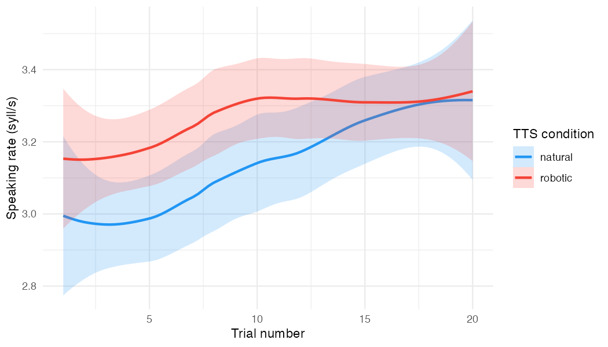
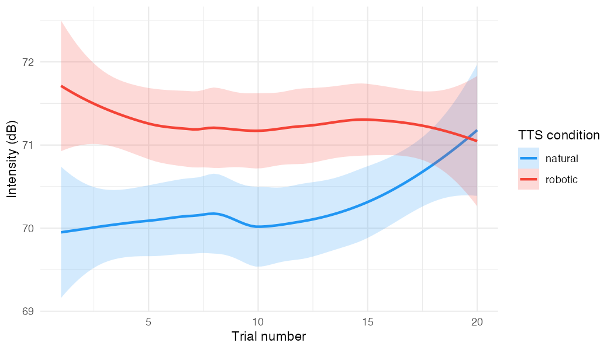

# Results: Speaking Rate & Intensity by TTS Condition

## Model specification

Both outcomes modeled with linear mixed-effects regression (`lmer`, REML) at the trial level:

```
outcome ~ TTS_condition * trial + (1 | participant)
```

- **TTS_condition:** sum coded (natural = −0.5, robotic = +0.5), so the intercept = grand mean across conditions and the coefficient = robotic − natural
- **trial:** linear trial number (1–20); with sum coding this represents the average slope across both conditions
- **TTS_condition × trial:** difference in trial slope between conditions
- **Random intercept for participant:** accounts for baseline differences between speakers
- p-values via Satterthwaite's method (`lmerTest`)
- **Outlier filtering:** Mahalanobis distance (D) computed jointly on speaking rate and intensity; 1 trial excluded (D > 6); final N = 1,402

---

## Speaking rate

**N:** 1,402 trials, 71 participants

| Term | Estimate | SE | t | p |
|---|---|---|---|---|
| Intercept (grand mean) | 3.09 syll/s | 0.07 | 43.24 | < .001 |
| TTS condition (robotic − natural) | +0.73 syll/s | 0.12 | 5.90 | < .001 |
| Trial (avg. slope) | +0.016 syll/s | 0.004 | 4.47 | < .001 |
| TTS condition × trial | −0.010 syll/s | 0.007 | −1.50 | .135 |

**Random effects:** participant intercept variance = 0.24; residual variance = 0.56

### Interpretation

The grand mean speaking rate across both conditions was 3.09 syll/s. The robotic condition was significantly faster (+0.73 syll/s, p < .001). On average across conditions, speaking rate increased over trials (+0.016 syll/s per trial, p < .001). The interaction did not reach significance (p = .135), meaning the rate gap between conditions did not reliably change across trials.

### Figure



The loess-smoothed plot shows robotic starting higher and both conditions converging by trial 20, consistent with the marginal interaction. Confidence ribbons represent 95% CI from the loess fit.

---

## Intensity

**N:** 1,402 trials, 71 participants

| Term | Estimate | SE | t | p |
|---|---|---|---|---|
| Intercept (grand mean) | 70.84 dB | 0.35 | 201.60 | < .001 |
| TTS condition (robotic − natural) | +5.06 dB | 0.49 | 10.41 | < .001 |
| Trial (avg. slope) | +0.019 dB | 0.011 | 1.69 | .092 |
| TTS condition × trial | −0.070 dB | 0.023 | −3.10 | .002 |

**Random effects:** participant intercept variance = 7.45; residual variance = 6.40

### Interpretation

The grand mean intensity across both conditions was 70.84 dB. The robotic condition was substantially louder (+5.06 dB, p < .001). The average trial slope across conditions was near zero and marginal (p = .092), meaning there was no reliable overall change in intensity across trials. However, the significant interaction (p = .002) reveals that the conditions diverged in their trajectories: the natural condition increased over trials (slope = 0.019 + 0.035 = +0.054 dB/trial) while robotic was essentially flat (slope = 0.019 − 0.035 = −0.016 dB/trial). As a result, the initial 5.06 dB advantage of the robotic condition eroded across the experiment.

### Figure



The loess-smoothed plot shows the robotic condition starting ~1.5 dB higher and the two conditions converging around trial 20, visually consistent with the significant interaction. Confidence ribbons represent 95% CI from the loess fit.

### Note on the simple model

A simpler regression on participant means (no trial, no random effects) yielded only a marginal condition effect for intensity (p = .071). The trial × condition interaction revealed here shows that the condition difference is larger early in the experiment and attenuates over time — this structure was masked by averaging across trials.
