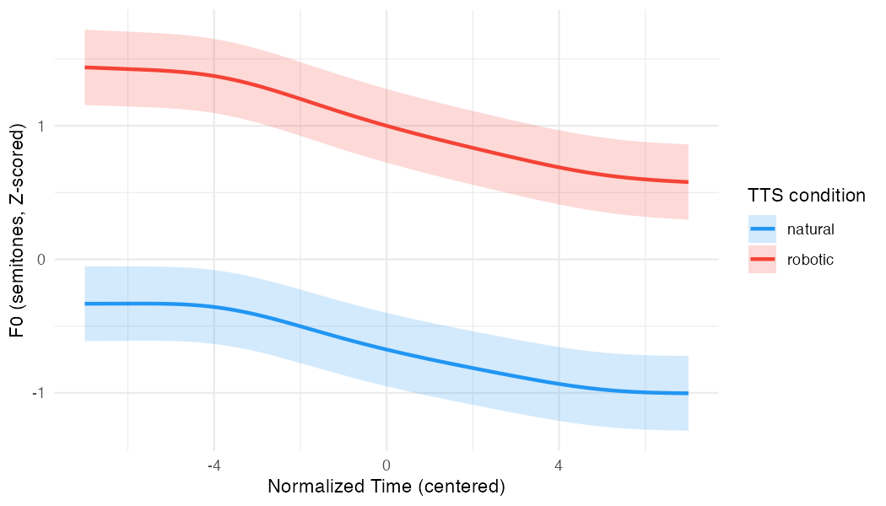
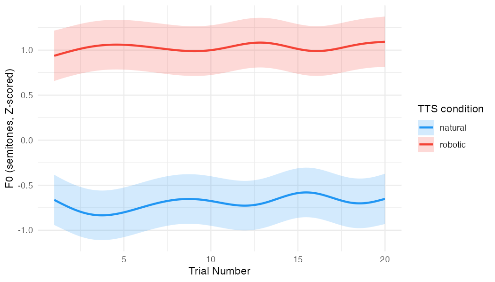

# GAM Results: F0 by TTS Condition

## Model specification

```
f0_st ~ TTS_condition +
    s(time, k = 10) +
    s(time, by = TTS_condition, k = 10) +
    s(trial, by = TTS_condition, k = 10) +
    s(participant, bs = "re") +
    s(trial_fac, bs = "re") +
    s(time, participant, bs = "fs", m = 1, k = 8)
```

- **Outcome:** Gender-normalized F0 — F0 was first converted to semitones (12 × log₂(Hz)), then z-scored within gender (subtract gender-specific mean, divide by gender-specific SD). Values represent standard deviation units relative to the gender-matched distribution, removing the male/female baseline shift while preserving individual speaker variation
- **Time** centered at interval 8 (midpoint of the 15-interval contour), so the intercept = F0 at the utterance midpoint
- **Smooths:** `s(time)` and `s(time, by = TTS_condition)` use a thin-plate spline (k = 10); `s(trial, by = TTS_condition)` captures nonlinear learning trends (k = 10); `s(time, participant, bs = "fs")` gives each participant their own contour deviation (factor smooth, k = 8); random intercepts for participant and trial via `bs = "re"`
- **Estimation:** `bam()` with fREML and `discrete = TRUE` for efficiency
- **N:** 19,140 observations (1,276 trials × 15 intervals)
- **R² (adj):** 0.670 — model explains 67.6% of deviance

---

## Speaker sample

The sample consisted of 71 speakers. Per-speaker grand mean F0 ranged from 112 Hz to 259 Hz — indicating a predominantly female sample. Only approximately 5 speakers fell in the male range. Gender-specific z-scoring was applied to remove the male/female baseline shift: female speakers were normalized to the female distribution (mean = 93.3 st, SD = 2.94 st, ≈ 220 Hz) and male speakers to the male distribution (mean = 86.1 st, SD = 4.41 st, ≈ 155 Hz).

---

## Parametric terms

| Term | Estimate | SE | t | p |
|---|---|---|---|---|
| Intercept (natural, midpoint) | −0.68 z | 0.14 | −4.88 | < .001 |
| TTS condition: robotic | +1.72 z | 0.04 | 45.11 | < .001 |

The intercept represents the natural condition at the utterance midpoint: participants' F0 sat **0.68 SD below the gender-matched mean** when shadowing natural speech. The robotic condition was **1.72 SD higher** than natural — a large, highly significant effect.

---

## Smooth terms

| Smooth | edf | F | p |
|---|---|---|---|
| s(time) — overall contour | 5.13 | 10.48 | < .001 |
| s(time) × natural | 1.00 | 0.02 | .893 |
| s(time) × robotic | 1.00 | 1.32 | .250 |
| s(trial) × natural | 7.63 | 9.26 | < .001 |
| s(trial) × robotic | 6.60 | 3.22 | .001 |
| s(participant) — random intercept | 34.96 | — | .995 |
| s(trial_fac) — random intercept | 9.22 | — | .413 |
| s(time, participant) — random contours | 282.39 | — | 1.000 |

### F0 contour shape

The overall time smooth (edf = 5.13) is significant, capturing a falling declination pattern across the utterance shared by both conditions. Neither by-condition time smooth deviates significantly from this shared shape (p = .893 and p = .250), meaning the two conditions produce the **same F0 contour shape** — the robotic condition is shifted uniformly upward rather than shaped differently.



### Trial-by-trial trend

Both conditions show a significant nonlinear trend over trial number. The **natural** condition (edf = 7.63, p < .001) shows a complex non-monotonic pattern across trials. The **robotic** condition also shows a significant nonlinear trend (edf = 6.60, p = .001), which was not present in earlier model versions using different normalization — suggesting that the trial-level trajectory in the robotic condition is meaningful once gender is properly accounted for.



---

## Data processing notes

- Raw trials: 1,410
- Dropped for < 8 voiced intervals: 22
- Dropped as Mahalanobis outliers (D > 6, computed on normalized contours): 112
- Final: 1,276 trials
- Missing edge intervals were filled by row-wise linear interpolation prior to outlier filtering
- F0 converted to semitones re: 1 Hz via 12 × log₂(Hz), then z-scored within gender using gender-specific mean and SD computed across all observations
