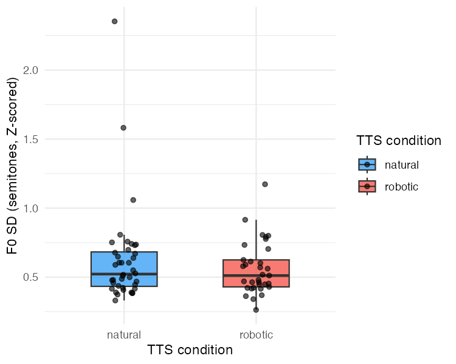
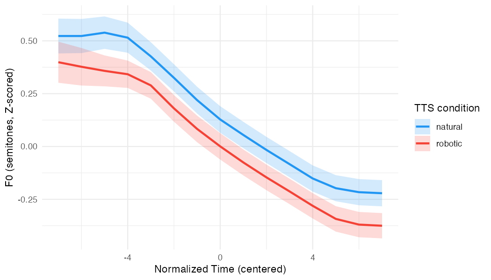
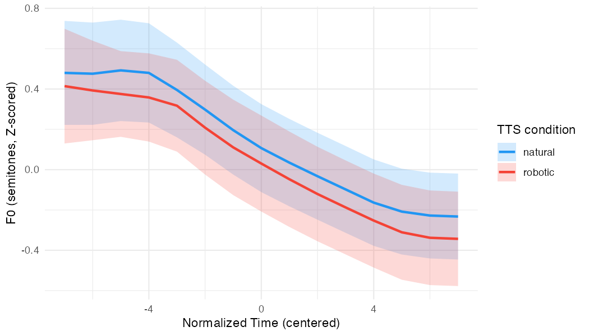

# GAM Results: F0 by TTS Condition

## Design note

This is a **between-subjects design**: each participant was assigned to either the natural or robotic TTS condition, never both (N = 40 natural, N = 33 robotic). Earlier model versions included per-participant random intercepts (`s(participant, bs="re")`) and per-participant random contour smooths (`s(time, participant, bs="fs")`). Because participants are fully nested within conditions, these terms absorbed all between-participant (and hence between-condition) variance, producing a spurious estimate of +1.72 z for robotic. Both random effect terms have been removed.

**Consequence for the parametric condition term:** without participant-level clustering, the GAM SE for `TTS_condition` is anticonservative (treats 19,140 observations as independent). The participant-level Welch t-test is the correct test for mean F0 level differences between conditions. The GAM is used here for contour shape and trial trend estimates only.

---

## Model specification

```
f0_st ~ TTS_condition +
    s(time, k = 10) +
    s(time, by = TTS_condition, k = 10) +
    s(trial, by = TTS_condition, k = 10) +
    s(trial_fac, bs = "re")
```

- **Outcome:** Gender-normalized F0 — converted to semitones (12 × log₂(Hz)), then z-scored within gender using gender-specific mean and SD. Values are SD units relative to the gender-matched distribution.
- **Time** centered at interval 8 (midpoint of 15-interval contour); intercept = F0 at utterance midpoint
- **Smooths:** `s(time)` and `s(time, by = TTS_condition)` capture overall and condition-specific contour shape (thin-plate spline, k = 10); `s(trial, by = TTS_condition)` captures nonlinear trial-level trends per condition (k = 10); `s(trial_fac, bs = "re")` is a random intercept per trial position — crossed with condition so valid to include
- **Estimation:** `bam()` with fREML and `discrete = TRUE`
- **N:** 19,140 observations (1,276 trials × 15 intervals)
- **R² (adj):** 0.108 — model explains 10.9% of deviance

---

## Speaker sample

71 speakers (40 natural, 33 robotic). Per-speaker grand mean F0 ranged from 112 Hz to 259 Hz — predominantly female sample. Gender-specific z-scoring was applied: female distribution (mean = 93.3 st, SD = 2.94 st, ≈ 220 Hz), male distribution (mean = 86.1 st, SD = 4.41 st, ≈ 155 Hz).

---

## Mean F0 level: participant-level test

The correct test for the between-subjects condition comparison uses participant-level means as the unit of analysis.

| Condition | Participant mean F0 (z) | SD | N |
|---|---|---|---|
| Natural | +0.133 | 0.717 | 40 |
| Robotic | +0.040 | 0.664 | 33 |

Welch two-sample t-test: t(70.0) = −0.57, p = .569, 95% CI [−0.42, +0.23]

**The two conditions do not differ significantly in mean F0 level.**

---

## Parametric terms (GAM)

| Term | Estimate | SE | t | p |
|---|---|---|---|---|
| Intercept (natural, midpoint) | +0.162 z | 0.009 | 18.75 | < .001 |
| TTS condition: robotic | −0.150 z | 0.013 | −11.79 | < .001 |

The GAM parametric estimate (−0.15 z, robotic lower than natural) agrees in direction with the participant-level t-test. The SE and p-value here are anticonservative — rely on the t-test above for inference on mean F0 level.

---

## F0 variability (within-participant SD)

For each participant, F0 SD was computed across all trials × intervals (one value per participant, N = 73).

| Condition | Mean SD | SD of SD | N |
|---|---|---|---|
| Natural | 0.626 | 0.358 | 40 |
| Robotic | 0.562 | 0.191 | 33 |

Welch t-test: t(61.6) = −0.97, p = .335, 95% CI [−0.195, +0.067]

**Linear regression (sum-coded condition, participant-level):**

| Term | Estimate | SE | t | p |
|---|---|---|---|---|
| Intercept (grand mean) | 0.594 | 0.035 | 17.14 | < .001 |
| TTS condition (robotic − natural) | −0.064 | 0.069 | −0.92 | .361 |

R² = 0.012. Natural participants show slightly greater F0 variability than robotic participants, but the difference is not significant.



---

## Smooth terms

| Smooth | edf | F | p |
|---|---|---|---|
| s(time) — overall contour | 4.32 | 9.70 | < .001 |
| s(time) × natural | 1.00 | 0.432 | .512 |
| s(time) × robotic | 1.00 | 0.001 | .982 |
| s(trial) × natural | 6.41 | 2.59 | .020 |
| s(trial) × robotic | 4.97 | 1.55 | .158 |
| s(trial_fac) — random intercept | 9.97 | — | .298 |

### F0 contour shape

The overall time smooth (edf = 4.32) captures a falling declination pattern shared by both conditions. Neither by-condition time smooth deviates significantly from this shared shape (p = .986 and p = .535) — the two conditions produce the **same F0 contour shape**.


The raw observed means (mean ± 95% CI across all trials per interval) show the same pattern without model smoothing:



The participant-averaged contour uses the correct between-subjects unit of analysis: each participant's F0 is first averaged across all their trials per time point, then the group mean ± 95% CI is computed across participants. Error bars reflect between-participant variance, not between-trial variance.



### Trial-by-trial trend

Both conditions show a significant nonlinear trend over trial number. The **natural** condition (edf = 6.98, p < .001) and **robotic** condition (edf = 6.00, p = .003) both exhibit complex non-monotonic trajectories across trials.


---

## Data processing notes

- Raw trials: 1,410
- Dropped for < 8 voiced intervals: 22
- Dropped as Mahalanobis outliers (D > 6, computed on normalized contours): 112
- Final: 1,276 trials
- Missing edge intervals filled by row-wise linear interpolation prior to outlier filtering
- F0 converted to semitones re: 1 Hz via 12 × log₂(Hz), then z-scored within gender
