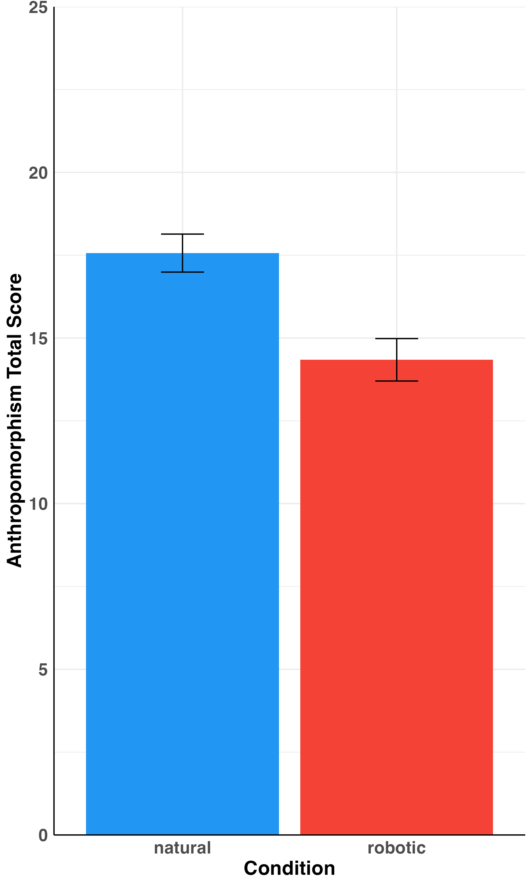
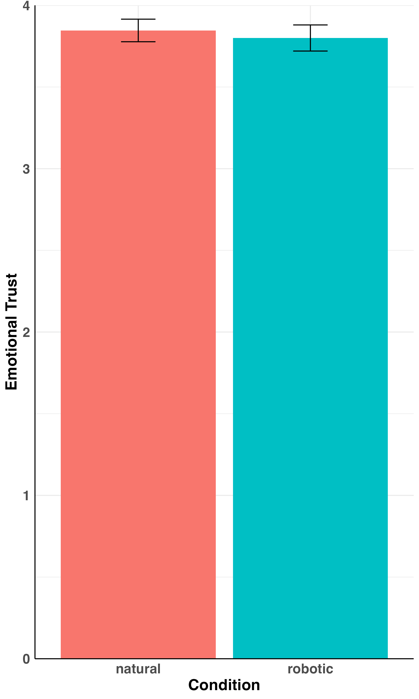
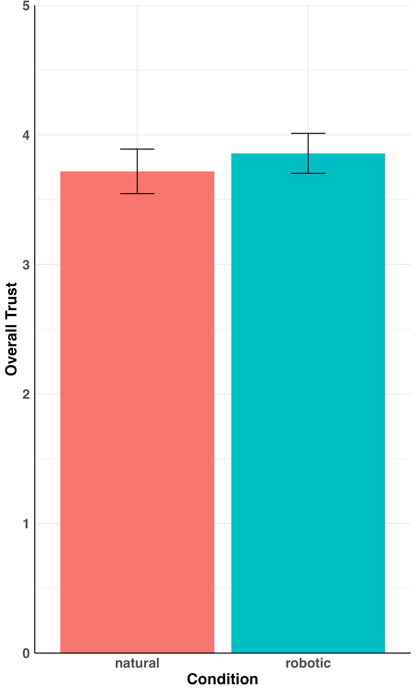
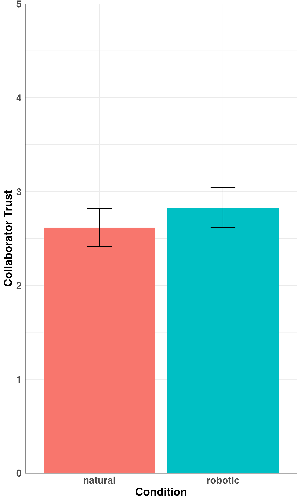
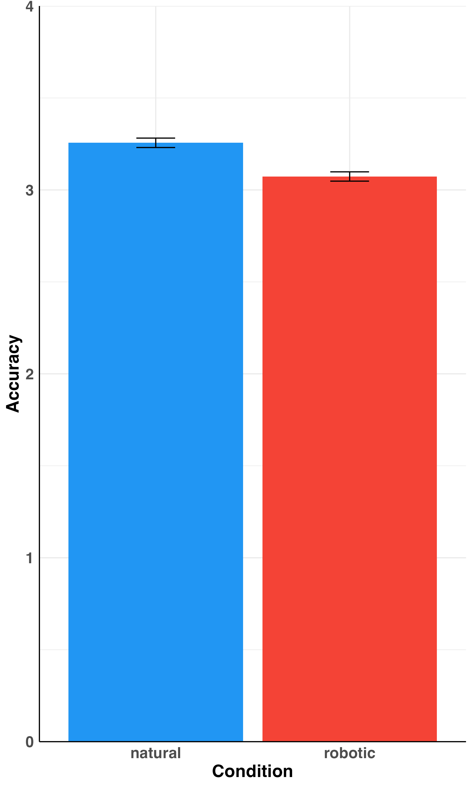
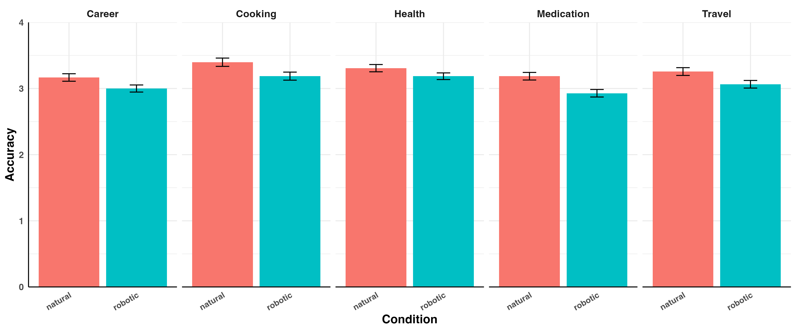
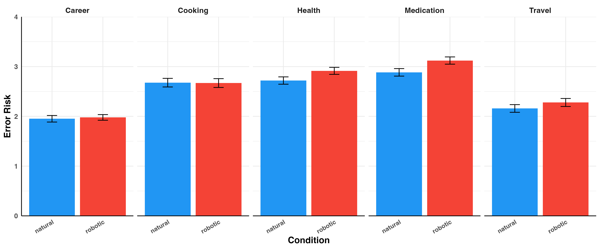
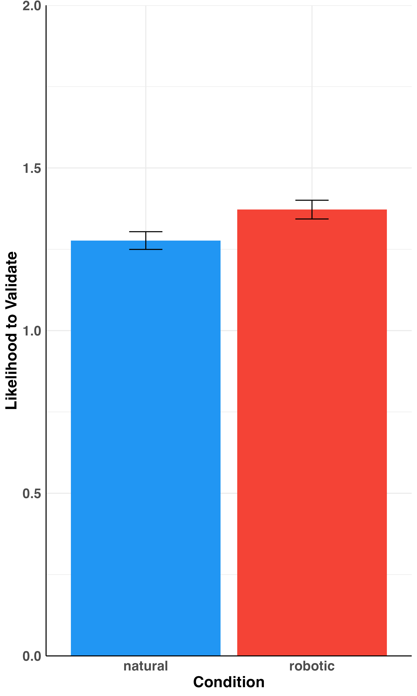
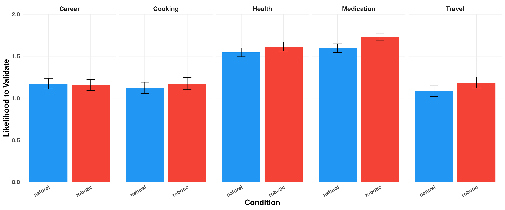

# Results Summary

**N = 74 participants**, ~1,479 trial-level observations (20 trials per participant). Participants were randomly assigned to either a **natural** or **robotic** voice condition and completed 20 advice trials spanning five domains: Career, Cooking, Health, Medication, and Travel. The core question was whether voice naturalness — a surface-level feature of the AI — would affect how much people anthropomorphized it, trusted it, and relied on its advice.

Categorical predictors use **sum coding**, meaning each coefficient reflects that level's deviation from the grand mean across all conditions/domains. Travel is the implicit omitted level for domain (its effect is the negative sum of the other four).

---

## 1. Anthropomorphism

**Model:** `anth_total_score ~ voice_condition` (OLS, participant-level)

Anthropomorphism was measured with a composite scale (range 0–30) assessing the degree to which participants perceived the AI as having human-like qualities. This was measured once per participant at the end of the session.

The manipulation worked as intended. Participants in the natural voice condition rated the AI as significantly more human-like (grand mean = 15.95, natural condition ≈ 17.56, robotic condition ≈ 14.34). The effect is moderate in size (R² = .16), meaning voice naturalness alone explained about 16% of the variance in anthropomorphism scores. This gives us confidence that the manipulation was felt by participants — they genuinely perceived a difference between the two voices.

| Predictor | β | SE | t | p |
|---|---|---|---|---|
| Intercept (grand mean) | 15.95 | 0.43 | 37.23 | < .001 |
| Voice: natural | **+1.61** | 0.43 | 3.76 | **< .001** |

R² = .16, F(1, 72) = 14.13, p < .001

---

## 2. Trust (participant-level)

**Models:** separate OLS regressions for each trust subscale, measured once per participant post-session.

Given that the natural voice produced higher anthropomorphism, one might expect it to also generate greater trust. That is not what happened. Across all three trust measures — emotional trust, overall trust, and collaborator trust — the voice condition had no significant effect. The effect sizes are negligible (R² < .01 for all three), and the direction is not even consistent (emotional trust is slightly higher in the natural condition; overall and collaborator trust are slightly lower). This pattern suggests that while participants noticed the voice sounded more human, this perception did not carry over into how much they trusted the AI's advice or saw it as a reliable partner.

### 2a. Emotional Trust

Emotional trust was a composite of four binary True/False items: "The system was knowledgeable about my questions," "The system's responses to my questions were in my best interest," "I believe the system's responses to me were honest," and "I believe the system's responses to me were unbiased" (range 0–4). Scores were nearly identical across conditions, with a negligible and non-significant difference of 0.02 points. The grand mean of 3.82 indicates participants almost universally endorsed all four items, regardless of voice.

| Predictor | β | SE | t | p |
|---|---|---|---|---|
| Intercept | 3.82 | 0.05 | 72.74 | < .001 |
| Voice: natural | +0.02 | 0.05 | 0.44 | .662 |

### 2b. Overall Trust

Overall trust was a single item: "Please rate your impression of the system" on a scale from 1 (Extremely untrustworthy) to 5 (Extremely trustworthy). No significant difference between conditions. The grand mean of 3.79 sits just above the neutral midpoint of 3, indicating participants were cautiously but not strongly trusting of the system.

| Predictor | β | SE | t | p |
|---|---|---|---|---|
| Intercept | 3.79 | 0.12 | 32.49 | < .001 |
| Voice: natural | −0.07 | 0.12 | −0.60 | .552 |

### 2c. Collaborator Trust

Collaborator trust was a single item: "Please rate your impression of the system" on a scale from 1 (Extremely like a tool) to 5 (Extremely like a collaborator). This was the lowest-rated trust dimension (grand mean ≈ 2.72), sitting below the neutral midpoint — participants tended to see the AI more as a tool than a collaborator regardless of how it sounded. Voice condition had no significant effect here either.

| Predictor | β | SE | t | p |
|---|---|---|---|---|
| Intercept | 2.72 | 0.15 | 18.41 | < .001 |
| Voice: natural | −0.11 | 0.15 | −0.72 | .473 |

---

## 3. Trial-Level Outcomes

**Models:** linear mixed models (LMM) with a random intercept per participant (`1 | user_id`), fit by maximum likelihood. Fixed effects include voice condition, domain, their interaction, and trial number (linear). Degrees of freedom estimated via Satterthwaite's method. These models account for the fact that each participant contributed 20 observations, controlling for individual differences in baseline response tendencies.

Three outcomes were measured on each trial. **Perceived accuracy** asked "How accurate is the system's response?" (1 = Not at all accurate, 4 = Completely accurate). **Error risk** asked "If you were relying on this information, how risky would it be if the system got this information wrong?" (1 = Not at all risky, 4 = Extremely risky). **Validation** asked "Would you validate the system's answer with other sources?" (0 = No, 1 = Maybe, 2 = Yes). All three were rated immediately after each trial.

### 3a. Perceived Accuracy

Participants rated how accurate they thought the AI's response was on each trial (1–4 scale). The grand mean of 3.25 indicates participants generally found the AI's responses quite accurate. The natural voice condition showed only a marginal, non-significant trend toward higher perceived accuracy (β = +0.10, p = .082) — this is worth noting as a pattern worth following up, but should not be over-interpreted given the p-value and the absence of effects on trust or behavioral reliance.

More interesting is the domain effect. Cooking prompted the highest perceived accuracy (above the grand mean by 0.13 points), while Medication produced the lowest (below by 0.12 points). Career also fell below the grand mean. This likely reflects differences in how confidently participants could evaluate the AI's responses — cooking advice may feel easier to assess, whereas medication and career advice may seem more complex or uncertain. Health fell slightly above the grand mean.

There was also a small but significant **decline in perceived accuracy over the course of the session** (β = −0.008 per trial, p = .002). Across 20 trials, this amounts to roughly a 0.15-point cumulative drop — possibly reflecting growing skepticism or fatigue as the session progressed.

None of the voice × domain interactions reached significance, meaning the voice trend (if any) was not specific to any particular topic area.

| Predictor | β | SE | t | p |
|---|---|---|---|---|
| Intercept | 3.25 | 0.06 | 54.58 | < .001 |
| Voice: natural | +0.10 | 0.05 | 1.76 | .082 |
| Domain: Career | −0.08 | 0.03 | −2.97 | .003 |
| Domain: Cooking | +0.13 | 0.03 | 4.59 | < .001 |
| Domain: Health | +0.08 | 0.03 | 2.82 | .005 |
| Domain: Medication | −0.12 | 0.03 | −4.31 | < .001 |
| Trial (linear) | −0.008 | 0.002 | −3.17 | .002 |
| Voice × domain interactions | — | — | all < 1.28 | all > .20 |

Random effects: participant variance = 0.20, residual variance = 0.28.

### 3b. Error Risk

Error risk captures participants' perception of how risky it would be to rely on the AI's information if it turned out to be wrong (1–4 scale). The grand mean of 2.52 sits near the midpoint of the scale. Voice condition had no significant effect (β = −0.07, p = .149), meaning participants did not perceive more or less risk based on how human the AI sounded.

Domain was again the dominant predictor. The pattern here is intuitive: **Career prompted by far the least risky reliance** (0.56 points below the grand mean), while **Medication prompted the most** (0.47 above). This suggests participants naturally calibrated their risk-taking to the perceived stakes of each domain — they were more cautious with career advice and more willing to defer to the AI on topics like medication, possibly because these feel more technical or harder to second-guess. Health also prompted above-average error risk, while Cooking was slightly elevated. Travel (the implicit reference) sat near the grand mean.

Unlike accuracy, there was **no decline in error risk over trials** — participants' willingness to rely on the AI remained stable across the session.

| Predictor | β | SE | t | p |
|---|---|---|---|---|
| Intercept | 2.52 | 0.06 | 40.69 | < .001 |
| Voice: natural | −0.07 | 0.05 | −1.46 | .149 |
| Domain: Career | −0.56 | 0.04 | −12.60 | < .001 |
| Domain: Cooking | +0.14 | 0.04 | 3.12 | .002 |
| Domain: Health | +0.29 | 0.04 | 6.45 | < .001 |
| Domain: Medication | +0.47 | 0.04 | 10.37 | < .001 |
| Trial (linear) | +0.000 | 0.004 | 0.05 | .960 |
| Voice × domain interactions | — | — | all < 1.43 | all > .15 |

Random effects: participant variance = 0.12, residual variance = 0.74.

### 3c. Likelihood to Validate

Validation captures whether participants said they would check the AI's answer against other sources (0 = No, 1 = Maybe, 2 = Yes). The grand mean of 1.38 — sitting between "Maybe" and "Yes" — indicates moderate willingness to verify overall. Voice condition had no significant effect (β = −0.03, p = .463).

The domain pattern here mirrors the error risk findings and reinforces the same interpretation. **Medication and Health prompted the most validation** (0.32 and 0.24 above the grand mean, respectively), consistent with participants being more vigilant in high-stakes health contexts. **Career and Cooking prompted the least** (both about 0.17–0.19 below the grand mean), suggesting participants felt less need to verify AI advice in lower-stakes or more familiar domains.

The combination of high error risk *and* high validation for Medication is notable: participants were simultaneously more willing to rely on AI advice in this domain *and* more likely to want to verify it — suggesting an awareness of the stakes even as they deferred to the AI in the moment.

| Predictor | β | SE | t | p |
|---|---|---|---|---|
| Intercept | 1.38 | 0.05 | 25.09 | < .001 |
| Voice: natural | −0.03 | 0.05 | −0.74 | .463 |
| Domain: Career | −0.17 | 0.03 | −5.19 | < .001 |
| Domain: Cooking | −0.19 | 0.03 | −5.71 | < .001 |
| Domain: Health | +0.24 | 0.03 | 7.31 | < .001 |
| Domain: Medication | +0.32 | 0.03 | 9.65 | < .001 |
| Trial (linear) | −0.004 | 0.003 | −1.37 | .170 |
| Voice × domain interactions | — | — | all < 1.28 | all > .20 |

Random effects: participant variance = 0.14, residual variance = 0.40.

---

## Key Takeaways

**Voice condition mattered for perception but not for behavior.** Participants clearly noticed the difference between the natural and robotic voices — anthropomorphism scores were significantly higher in the natural condition (β = +1.61, p < .001, R² = .16). But this perceptual difference did not propagate downstream into how much participants trusted the AI, how much risk they took with its advice, or how often they sought to verify it. Across six dependent variables — emotional trust, overall trust, collaborator trust, perceived accuracy, error risk, and validation — not a single test reached the p < .05 threshold for voice condition. The manipulation changed how the AI was perceived, but not how participants actually evaluated or engaged with it.

**Domain context drove the behavioral effects that voice could not.** How participants responded to AI advice was strongly shaped by the topic area. Medical and health domains elicited more cautious engagement: higher error risk (perhaps reflecting deference to perceived expertise) but also higher validation rates (reflecting awareness of the stakes). Career advice was treated with the most skepticism, generating the lowest reliance and least validation. These domain effects were large and consistent across all three outcomes, with none showing a voice × domain interaction — meaning voice had no moderating influence on domain-specific patterns either.

**Perceived accuracy declined modestly over trials** (β = −0.008, p = .002), pointing to a small fatigue or growing skepticism effect across the session. No such trend appeared for error risk or validation, suggesting this was specific to accuracy judgments rather than a general shift in how participants engaged with the AI.
